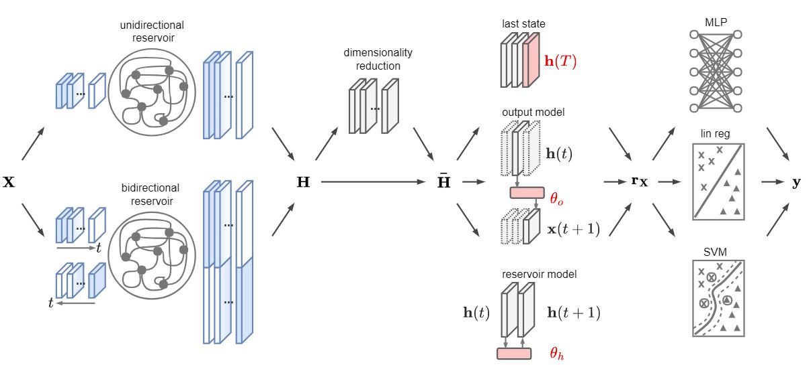

# Framework overview



This library allows to quickly implement different architectures based on Reservoir Computing (the family of approaches popularized in machine learning by Echo State Networks) for classification or clustering of univariate/multivariate time series.

Several options are available to customize the RC model, by selecting different configurations for each module.
1. The reservoir module specifies the reservoir configuration (*e.g.*, bidirectional, leaky neurons, circle topology);
2. The dimensionality reduction module (optionally) applies a dimensionality reduction on the produced sequence of the reservoir's states;
3. The representation module defines how to represent the input time series from the sequence of reservoir's states;
4. The readout module specifies the model to use to perform the final classification. 

The representations obtained at step 3 can also be used to perform clustering.

This library also implements the novel *reservoir model space* as representation for the time series.
Details on the methodology can be found in the [original paper](https://ieeexplore.ieee.org/abstract/document/9127499) (Arix version [here](https://arxiv.org/abs/1803.07870)).

**Required libraries**

- sklearn (tested on version 0.22.1)
- scipy

The code has been tested on Python 3.7, but lower versions should work as well.

**Quick execution**

Run the script ```classification_example.py``` or ```clustering_example.py``` to perform a quick execution on a benchmark dataset of multivariate time series.

For the clustering example, check also the notebook [here](https://github.com/FilippoMB/Reservoir-Computing-framework-for-multivariate-time-series-classification/blob/master/code/clustering_example.ipynb).

## Configure the RC-model

The main class ```RC_model``` contained in [modules.py](https://github.com/FilippoMB/Reservoir-model-space-classifier/blob/master/code/modules.py) permits to specify, train and test an RC-model.
The RC-model is configured by passing to the constructor of the class ```RC_model``` a set of parameters. To get an idea, you can check ```classification_example.py``` or ```clustering_example.py``` where the parameters are specified through a dictionary (````config````). 

The available configuration hyperparameters are listed in the following and, for the sake of clarity, are grouped according to which module of the architecture they refer to.

    
**1. Reservoir:**

- n_drop - number of transient states to drop
- bidir - use a bidirectional reservoir (True or False)
- reservoir - precomputed reservoir (object of class ````Reservoir```` in [reservoir.py](https://github.com/FilippoMB/Reservoir-model-space-classifier/blob/master/code/reservoir.py); if ```None```, the following hyperparameters must be specified:
    - n\_internal\_units = number of processing units in the reservoir
    - spectral_radius = largest eigenvalue of the reservoir matrix of connection weights (to guarantee the Echo State Property, set spectral\_radius <= leak <= 1)
    - leak = amount of leakage in the reservoir state update (optional, ````None```` or ````1.0```` --> no leakage)
    - circ = if True, generate a determinisitc reservoir with circle topology where each connection has the same weight
    - connectivity = percentage of nonzero connection weights (ignored if circ = ````True````)
    - input_scaling = scaling of the input connection weights (note that weights are randomly drawn from {-1,1})
    - noise_level = deviation of the Gaussian noise injected in the state update
            
**2. Dimensionality reduction:**

- dimred_method - procedure for reducing the number of features in the sequence of reservoir states; possible options are: ````None```` (no dimensionality reduction), ````'pca'```` (standard PCA) or ````'tenpca'```` (tensorial PCA for multivariate time series data)
- n_dim - number of resulting dimensions after the dimensionality reduction procedure
    
**3. Representation:**

- mts_rep - type of multivariate time series representation. It can be ````'last'```` (last state), ````'mean'```` (mean of all states), ````'output'```` (output model space), or ````'reservoir'```` (reservoir model space)
- w\_ridge\_embedding - regularization parameter of the ridge regression in the output model space and reservoir model space representation; ignored if mts_rep is ````None````
    
**4. Readout:**

- readout_type - type of readout used for classification. It can be ````'lin'```` (ridge regression), ````'mlp'```` (multilayer perceptron), ````'svm'```` (support vector machine), or ````None````. If ````None````, the input representations will be stored in the ````.input_repr```` attribute: this is useful for clustering and visualization. Also, if ````None````, the other Readout hyperparameters can be left unspecified.
- w\_ridge - regularization parameter of the ridge regression readout (only when readout_type is ````'lin'````)              
- mlp\_layout - list with the sizes of MLP layers, e.g. ````[20,20,10]```` defines a MLP with 3 layers of 20, 20 and 10 units respectively (only when readout_type is ````'mlp'````)
- batch\_size - size of the mini batches used during training (only when readout_type is ````'mlp'````)
- num\_epochs - number of iterations during the optimization (only when readout_type is ````'mlp'````)
- w\_l2 = weight of the L2 regularization (only when readout_type is ````'mlp'````)
- learning\_rate = learning rate in the gradient descent optimization (only when readout_type is ````'mlp'````)
- nonlinearity = type of activation function; it can be ````{'relu', 'tanh', 'logistic', 'identity'}```` (only when readout_type is ````'mlp'````)
- svm\_gamma = bandwith of the RBF kernel (only when readout_type is ````'svm'````)
- svm\_C = regularization for the SVM hyperplane (only when readout_type is ````'svm'````)

## Train and test the RC-model for classification

The training and test function requires in input training and test data, which must be provided as multidimensional NumPy arrays of shape *[N,T,V]*, with:

- *N* = number of samples
- *T* = number of time steps in each sample
- *V* = number of variables in each sample

Training and test labels (Y and Yte) must be provided in one-hot encoding format, i.e. a matrix *[N,C]*, where *C* is the number of classes.

**Training**

````RC_model.train(X, Y)````

Inputs:

- X, Y: training data and respective labels

Outputs:

- tr\_time: time (in seconds) used to train the classifier

**Test**

````RC_module.test(Xte, Yte)````

Inputs:

- Xte, Yte: test data and respective labels

Outputs:

- accuracy, F1 score: metrics achieved on the test data


## Train the RC-model for clustering

As in the case of classification, the data must be provided as multidimensional NumPy arrays of shape *[N,T,V]*

**Training**

````RC_model.train(X)````

Inputs:

- X: time series data

Outputs:

- tr\_time: time (in seconds) used to generate the representations

Additionally, the representations of the input data X are stored in the attribute ````RC_model.input_repr````

## Time series datasets

A collection of univariate and multivariate time series dataset is available for download [here](https://mega.nz/#!aZkBwYDa!JZb99GQoUn4EoJYceCK3Ihe04hhYZYuIWn018gcQM8k). The dataset are provided both in MATLAB and Python (Numpy) format. Original raw data come from [UCI](https://archive.ics.uci.edu/ml/index.php), [UEA](https://www.groundai.com/project/the-uea-multivariate-time-series-classification-archive-2018/), and [UCR](https://www.cs.ucr.edu/~eamonn/time_series_data/) public repositories.


## Citation

Please, consider citing the original paper if you are using this library in your reasearch

	@article{bianchi2020reservoir,
	  title={Reservoir computing approaches for representation and classification of multivariate time series},
	  author={Bianchi, Filippo Maria and Scardapane, Simone and L{\o}kse, Sigurd and Jenssen, Robert},
	  journal={IEEE Transactions on Neural Networks and Learning Systems},
	  year={2020},
	  publisher={IEEE}
	}
    

## Tensorflow version
In the latest version of the repository there is no longer a dependency from Tensorflow, reducing the dependecies of this repository only to scipy and scikit-learn.
The MLP readout is now based on the scikit-learn implementation that, however, does not support dropout and the two custom activation functions, Maxout and Kafnets. These functionalities are still available in the branch "Tensorflow". Checkout it to use the Tensorflow version of this repository.

## License
The code is released under the MIT License. See the attached LICENSE file.
